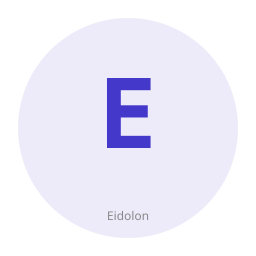

<!-- work-state: A+ mobile XCUI bridge + Android input actions (mobile-ios/android) + LaunchPlan→guest boot + serial guest exec + namespaces/seccomp + EnforcingSandbox + Phase D/E/F + T2 Docker/nanoVM/KVM/unikernel -->
[█████████░] ~90% — traits + macOS desktop; Windows `desktop-windows` SendInput+DXGI/GDI; Linux `desktop-linux` X11 XTEST+GetImage + Wayland portal Screenshot; T1 mobile xcrun/adb CLI + Android gated input + iOS XcuiBridge; Phase D session/audit; Landlock/cgroup/namespaces/seccomp + EnforcingSandbox; Phase E recording; Phase F security; T2 Docker + nanoVM/KVM + unikernel boot + serial/vsock guest exec + pack agent bake
<!-- AI-DD-META:START -->
<!-- This repository is planned, maintained, and managed by AI Agents only. -->
<!-- Slop issues are expected and intentionally present as part of an HITL-less -->
<!-- /minimized AI-DD metaproject of learning, refining, and building brute-force -->
<!-- training for both agents and the human operator. -->


> ⚠️ **AI-Agent-Only Repository**
>
> This repo is **planned, maintained, and managed exclusively by AI Agents**.
> Slop issues, rough edges, and AI artifacts are **expected and intentionally
> present** as part of an **HITL-less / minimized AI-DD** metaproject focused
> on learning, refining, and brute-force training both the agents and the
> human operator. Bug reports and contributions are still welcome, but please
> expect AI-generated code, comments, and documentation throughout.
<!-- AI-DD-META:END -->
## Work State

| Field | Value |
|---|---|
| Focus | **A+ T1 mobile** (`XcuiBridge` + gated Android `input` + **UIA2 lifecycle + HTTP session**) + **T1 CLI drivers** (`mobile-ios` / `mobile-android` / `mobile-uia2`) + **T2 LaunchPlan→guest boot** + namespaces/seccomp + Phase D session/audit + Landlock/cgroup + Phase E recording + Phase F security + T2 Docker/nanoVM/KVM/unikernel + T1 desktop scaffolding; local `cargo test --locked` |
| Local verify | `cargo test --locked` (workspace); optional `cargo test -p eidolon-desktop --features desktop-windows` (Windows host / cross-check); optional `cargo check -p eidolon-desktop --target x86_64-pc-windows-gnu --features desktop-windows`; optional `cargo test -p eidolon-desktop --features desktop-linux` (Linux host / hermetic on macOS); optional `cargo test -p eidolon-mobile --features mobile-ios,mobile-android,mobile-uia2`; optional `cargo test -p eidolon-desktop --features desktop-recording`; optional `cargo test -p eidolon-sandbox --features sandbox-session,sandbox-session-redis,sandbox-audit,sandbox-docker,sandbox-nanovm,sandbox-kvm,sandbox-unikernel,sandbox-vsock,sandbox-landlock,sandbox-cgroup,sandbox-namespaces,sandbox-seccomp` |
| crates.io | **Not published** |
| Daemon / REST | **Not shipped** — `/v1/` curl examples below are contractual aspirational docs only |

Progress: `█████████░` ~90% — traits + macOS desktop + **Windows SendInput/DXGI/GDI** (`desktop-windows`) + **Linux X11 XTEST/GetImage + Wayland portal Screenshot + RemoteDesktop/Screencast inject + opt-in restore-token persistence** (`desktop-linux`; `EIDOLON_DESKTOP_WAYLAND_RESTORE=1`) + **T1 mobile CLI + actions + UIA2 lifecycle + HTTP session** (`mobile-ios` / `mobile-android` / `mobile-uia2`: hermetic `xcrun`/`adb` probe + device list; Android gated `input`/screencap **real**; `Uia2Server` pinned Appium APK cache/fetch; `Uia2HttpClient` ureq session verbs; iOS `simctl` screenshot + `XcuiBridge`) + **Phase D** session/audit stores + **Redis session** (`sandbox-session-redis`) + **Landlock/cgroup/namespaces/seccomp** Linux hooks + `EnforcingSandbox` composition wire (`sandbox-landlock` / `sandbox-cgroup` incl. **`disk_mib`→`io.max` rbps/wbps** / `sandbox-namespaces` / `sandbox-seccomp`; macOS fail-loud) + **USER ns** identity + multi-range uid/gid maps via `newuidmap`/`newgidmap` (`EIDOLON_SANDBOX_NS_USER=1`) + **Phase E** `RecordingPipeline` / `FfmpegRecorder` (`desktop-recording`) + **Phase F** `PolicySecurityGate` / core security wiring + PlayCua dispatcher + T2 live Docker (`sandbox-docker`) + T2 nanoVM/KVM CLI + env-gated plan→guest spawn + **serial/stdio + vsock guest exec** (`sandbox-nanovm` / `sandbox-kvm` / `sandbox-unikernel` / `sandbox-vsock`; `UNIKERNEL_EXEC_INTEGRATION=1` / `UNIKERNEL_VSOCK_INTEGRATION=1`; prefer vsock when `EIDOLON_VSOCK_CID`+`EIDOLON_VSOCK_PORT` set) + **pack bake** of `eidolon-vsock-agent` into rootfs trees (`sandbox-rootfs-pack`) + **published GH Ext4 pin** (`rootfs-v0.1.0` / `pack::release_asset`); **not** Appium Desktop, RTMP/audio DSP recording, vault/OAuth (optional features `desktop-security-vault` / `desktop-security-oauth`), or **cgroup FS byte-capacity quotas** (io.max bandwidth shipped). Default GH Ext4 pin filled (`rootfs-v0.1.0`).


### Crate honesty (stubs vs real)

| Crate | Reality today | Not yet (remaining) |
|---|---|---|
| `eidolon-core` | **Real** — traits, events, viewport, security validators, `VirtualStage` | — |
| `eidolon-desktop` | **macOS real**; Windows `SendInput`+DXGI/GDI (`desktop-windows` / `desktop-windows-dxgi`); Linux X11 XTEST+GetImage + Wayland portal Screenshot + RemoteDesktop/Screencast inject + **opt-in restore-token persistence** (`desktop-linux`; `EIDOLON_DESKTOP_WAYLAND_RESTORE=1`); Linux AT-SPI list/find/activate (`desktop-linux-atspi`); **Phase E** recording; **Phase F** `PolicySecurityGate` + optional EncryptedVault/OAuth PKCE (`desktop-security-vault` / `desktop-security-oauth`) | full ui_automation port from KDesktopVirt; full W3C desktop wire (not claimed); RTMP/audio DSP (intentionally not ported); stale/revoked Wayland restore tokens still prompt; paste/clear keysym chords only (no clipboard write) |
| `eidolon-mobile` | **`UnsupportedPlatform`** `MobileClient` default; **T1 CLI** `XcrunIosDriver` / `AdbAndroidDriver` (`mobile-ios` / `mobile-android`) when tools present; Android gated `input`/screencap **real**; **`Uia2Server`** Appium-shaped install/start/stop (`mobile-uia2`; env → SHA-256 assets/cache / `eidolon-fetch-uia2`); **`Uia2HttpClient`** (ureq) session verbs on `:6790` when server ready; **`mobile-appium-desktop`** Inspector launcher + local dashboard (`eidolon-appium-desktop`); iOS `simctl` screenshot + `XcuiBridge` (`EIDOLON_IOS_XCUI_BUNDLE` wins, else built in-tree XCUITest `eidolon-xcui-xctest`, else Rust `eidolon-xcui-helper`, else AppleScript); `InstrumentDiscovery`; in-memory `DeviceManager`; codes `EIDOLON_MOBILE_*` | full Electron Appium Desktop fork (not claimed); XCUI `.xcodeproj` under `native/ios/EidolonXcuiHelper`; UIA2 APKs via pinned Appium cache; no kmobile unarchive; destructive actions need `EIDOLON_MOBILE_ALLOW_ACTIONS=1` |
| `eidolon-sandbox` | **`UnsupportedPlatform`** `SandboxClient` + codes `EIDOLON_SANDBOX_*`; **real** `PlayCuaDispatcher`; **Phase D** session/audit (memory + fail-loud; file behind `sandbox-session` / `sandbox-audit`; Redis behind `sandbox-session-redis`); **T2** live Docker (`sandbox-docker`) when daemon up; **T2** nanoVM/KVM CLI (`sandbox-nanovm` / `sandbox-kvm`) + `LaunchPlan` compose (`try_from_plan`); env-gated guest process spawn + **serial/stdio + vsock exec** (`UNIKERNEL_BOOT_INTEGRATION` / `FIRECRACKER_INTEGRATION` / `NANOVM_INTEGRATION` + `UNIKERNEL_EXEC_INTEGRATION` / `UNIKERNEL_VSOCK_INTEGRATION`; prefer vsock when `EIDOLON_VSOCK_CID`+`PORT`; no-guest → `EIDOLON_SANDBOX_GUEST_NOT_RUNNING`); **T2** unikernel/rootfs + `boot`/`exec`/`vsock` (`sandbox-unikernel` / `sandbox-vsock`); **Landlock** (`sandbox-landlock`) + **cgroup v2** memory/CPU/disk-I/O (`sandbox-cgroup`; `disk_mib`→`io.max`) + **namespaces** (`sandbox-namespaces`; PID fork + mount `pivot_root` + **USER ns** identity `/proc` maps + multi-range `/etc/subuid` via `newuidmap`/`newgidmap`; `user_ns_mapped`) + **seccomp** (`sandbox-seccomp`) on Linux via `enforcement` + composition `EnforcingSandbox` (opt-in on `start`; feature-off → `EIDOLON_SANDBOX_ENFORCEMENT_DISABLED`); off-platform → `EIDOLON_SANDBOX_LANDLOCK_UNSUPPORTED` / `_CGROUP_UNSUPPORTED` / `_NAMESPACES_UNSUPPORTED` / `_SECCOMP_UNSUPPORTED` | production rootfs images with agent preinstalled; cgroup FS byte-capacity quotas; macOS `sandbox-exec`; tools absent → same fail-loud stubs (no KDesktopVirt unarchive) |


`get_metadata` on `SandboxClient` returns **requested policy** with image `stub:latest` — it does **not** introspect a running container.

### Source / archived satellites

Do **not** unarchive these in T0. Links for extraction reference only:

| Satellite | GitHub | Archive status |
|---|---|---|
| kmobile | https://github.com/KooshaPari/kmobile | **archived** |
| mobile-cli | https://github.com/KooshaPari/mobile-cli | **archived** |
| mobile-mcp | https://github.com/KooshaPari/mobile-mcp | **archived** |
| KDesktopVirt | https://github.com/KooshaPari/KDesktopVirt | **archived** |
| PlayCua | https://github.com/KooshaPari/PlayCua | active (not archived) |

> **Policy:** satellites remain archived — extract into Eidolon on demand. See [`docs/guides/satellite-archive-policy.md`](docs/guides/satellite-archive-policy.md).

> **Pinned references (Phenotype-org)**
> - MSRV: see rust-toolchain.toml
> - cargo-deny config: see deny.toml
> - cargo-audit: rustsec/audit-check@v2 weekly
> - Branch protection: 1 reviewer required, no force-push
> - Authority: phenotype-org-governance/SUPERSEDED.md

# Eidolon



[](https://sladge.net)
[](LICENSE)
[](Cargo.toml)
[](#status)

**Eidolon** — the Phenotype device automation collection. Unified trait-based API for desktop, mobile, and sandboxed environments. Most platform drivers are still stubs (fail-loud); macOS desktop is the first real driver.

## Install

**From repository root:**
```bash
cargo build --workspace
cargo test --workspace
```

**For individual crates:**
```bash
cargo build -p eidolon-core
cargo build -p eidolon-desktop
```

**Dependencies:** Rust 1.75+ (see `rust-toolchain.toml`). macOS desktop screenshots use `screencapture` (system). Optional Windows desktop driver: enable `eidolon-desktop` feature `desktop-windows` (alias `desktop-windows-dxgi`) — Win32 `SendInput` + DXGI Desktop Duplication (preferred) / GDI BMP fallback; destructive actions require `EIDOLON_DESKTOP_ALLOW_ACTIONS=1`; capture mode `EIDOLON_DESKTOP_WIN_CAPTURE=auto|dxgi|gdi`; live DXGI/GDI smoke on Windows only via `EIDOLON_DESKTOP_WIN_CAPTURE_SMOKE=1` (hermetic fail-loud off-Windows — see `docs/guides/windows-desktop-capture.md`). Optional Linux desktop driver: enable feature `desktop-linux` (X11 XTEST + GetImage BMP via `x11rb` when `DISPLAY` set; pure Wayland portal Screenshot + RemoteDesktop/Screencast inject via `ashpd` when only `WAYLAND_DISPLAY` set; portal miss/deny → `EIDOLON_DESKTOP_LINUX_WAYLAND_PORTAL_UNAVAILABLE`; device/stream gap → `EIDOLON_DESKTOP_LINUX_WAYLAND_INPUT_UNSUPPORTED`; destructive actions require `EIDOLON_DESKTOP_ALLOW_ACTIONS=1`). Optional Linux AT-SPI helpers: feature `desktop-linux-atspi` (wraps `atspi` 0.24; list/find/activate; bus miss → `EIDOLON_DESKTOP_LINUX_ATSPI_UNAVAILABLE`; **not** full Appium Desktop / W3C wire). Optional screen recording: enable `eidolon-desktop` feature `desktop-recording` and install system `ffmpeg` (`EIDOLON_FFMPEG` override supported). Optional iOS mobile CLI: feature `mobile-ios` + system `xcrun` / `xcodebuild` / `simctl` (`EIDOLON_XCRUN` / `EIDOLON_XCODEBUILD`); iOS tap/swipe/text prefer the in-tree XCUITest runner (`native/ios/EidolonXcuiHelper`; build with `Scripts/build-for-testing.swift`), or set `EIDOLON_IOS_XCUI_BUNDLE`, or build Rust `eidolon-xcui-helper` (`mobile-xcui-helper`), or `EIDOLON_IOS_ALLOW_APPLESCRIPT=1` (best-effort). See `docs/guides/ios-xcui-helper.md`. Optional Android mobile CLI: feature `mobile-android` + system `adb` (`EIDOLON_ADB`). Optional UiAutomator2 lifecycle + HTTP session client: feature `mobile-uia2` + pinned Appium APKs (env override or `eidolon-fetch-uia2` / durable SHA-256 cache; optional `EIDOLON_UIA2_PORT`); wraps ureq for `:6790` findElement/click. See `docs/guides/uia2-apks.md`. Destructive mobile actions require `EIDOLON_MOBILE_ALLOW_ACTIONS=1` (list-devices / version probes / Android viewport / UIA2 package probe stay ungated). Optional live Docker: enable `eidolon-sandbox` feature `sandbox-docker` (bollard) with a reachable Docker Engine (`EIDOLON_DOCKER` / `DOCKER_HOST` supported). Optional nanoVMs: feature `sandbox-nanovm` + system `ops` (`EIDOLON_OPS`); `OpsNanoVmClient::try_from_plan` + `NANOVM_INTEGRATION=1` / `UNIKERNEL_BOOT_INTEGRATION=1` for live `ops run`. Optional KVM/Firecracker: feature `sandbox-kvm` + system `firecracker` (`EIDOLON_FIRECRACKER`; Linux `/dev/kvm` for launch); `FirecrackerKvmClient::try_from_plan` + `FIRECRACKER_INTEGRATION=1` / `UNIKERNEL_BOOT_INTEGRATION=1` for live config boot. Optional unikernel/rootfs: feature `sandbox-unikernel` + rootfs path / `EIDOLON_ROOTFS` (optional kernel / `EIDOLON_KERNEL`); plan→argv always-on; env-gated spawn; guest exec still fail-loud. Optional vsock NDJSON guest I/O: feature `sandbox-vsock` (`EIDOLON_VSOCK_CID` / `EIDOLON_VSOCK_PORT`; live `UNIKERNEL_VSOCK_INTEGRATION=1`; macOS fail-loud). Optional Phase D file backends: `sandbox-session` / `sandbox-audit` (SHA-256). Optional Linux Landlock: feature `sandbox-landlock` (wraps `landlock` 0.4). Optional Linux cgroup v2 memory/CPU: feature `sandbox-cgroup`. Optional Linux namespaces: feature `sandbox-namespaces` (wraps `nix` 0.31 `unshare` + PID fork + USER uid/gid maps + mount `pivot_root`; `EIDOLON_SANDBOX_NS_PID` / `EIDOLON_SANDBOX_NS_USER` / `EIDOLON_SANDBOX_NS_UID_MAP` / `EIDOLON_SANDBOX_NS_GID_MAP` comma-separated ranges / `EIDOLON_SANDBOX_NS_USER_SUBIDS` for `/etc/subuid`; identity single-ID via `/proc`, multi-range via shadow-utils `newuidmap`/`newgidmap` with optional `EIDOLON_SANDBOX_NEWUIDMAP` / `EIDOLON_SANDBOX_NEWGIDMAP` overrides / `EIDOLON_SANDBOX_NS_PIVOT` + `EIDOLON_SANDBOX_NS_PIVOT_ROOTFS`). Optional Linux seccomp-bpf: feature `sandbox-seccomp` (wraps `seccompiler` 0.5; block-dangerous default). Off-platform Landlock/cgroup/namespaces/seccomp apply fails loud (`EIDOLON_SANDBOX_LANDLOCK_UNSUPPORTED` / `EIDOLON_SANDBOX_CGROUP_UNSUPPORTED` / `EIDOLON_SANDBOX_NAMESPACES_UNSUPPORTED` / `EIDOLON_SANDBOX_SECCOMP_UNSUPPORTED`). No bundled FFmpeg, Docker, ops, Firecracker, Xcode, platform-tools, or rootfs images.


See `docs/EXTRACTION_PLAN.md` and the [archived satellites](#source--archived-satellites) table for source material.

## Overview

Eidolon provides a modular trait surface for automating three platform families. **Honesty:** macOS desktop is a real driver; mobile ships **CLI probes + device list + gated Android input + iOS XcuiBridge + in-tree XCUITest host + UIA2 lifecycle + HTTP session client + optional Inspector/dashboard** behind features (`mobile-appium-desktop`; UIA2 APKs via pinned Appium cache); sandbox backends are mostly fail-loud with T2 CLI/Docker hooks (PlayCua dispatcher is real over an injectable port).

- **Desktop** — macOS: Core Graphics + `screencapture`; Windows: feature `desktop-windows` → `SendInput` + DXGI Desktop Duplication (GDI fallback; gated); Linux: feature `desktop-linux` → X11 XTEST + GetImage BMP (gated; XWayland ok) + pure Wayland portal Screenshot + RemoteDesktop/Screencast inject
- **Mobile** — fail-loud `MobileClient` default; **T1 CLI** `XcrunIosDriver` / `AdbAndroidDriver` (`mobile-ios` / `mobile-android`) when tools present; Android `input` gated-real; `Uia2Server` APK install/start (env/assets/cache) + `Uia2HttpClient` (`mobile-uia2`); iOS tap via `XcuiBridge`
- **Sandbox** — fail-loud `SandboxClient`; **Phase D** session/audit stores; **T2 live Docker** (`sandbox-docker`) when daemon reachable; **T2** nanoVM/KVM + `LaunchPlan` compose (`sandbox-nanovm` / `sandbox-kvm`; hermetic start; env-gated spawn; serial/vsock guest exec); **T2** unikernel/rootfs + `boot`/`exec`/`vsock` (`sandbox-unikernel` / `sandbox-vsock`); Landlock/cgroup/namespaces/seccomp via `EnforcingSandbox`; real `PlayCuaDispatcher` over injectable port

## Architecture

```
eidolon-core/       traits, events, viewport, security validators, VirtualStage
eidolon-desktop/    macOS real; Windows SendInput/DXGI/GDI (`desktop-windows`); Linux X11 + Wayland portal Screenshot/RemoteDesktop (`desktop-linux`); recording + Phase F security hooks
eidolon-mobile/     MobileClient stub; mobile-ios/android/uia2 CLI drivers; InstrumentDiscovery; DeviceManager in-memory
eidolon-sandbox/    SandboxClient stub; Phase D session/audit; Docker/nanoVM/KVM + Landlock/cgroup/namespaces/seccomp features; PlayCuaDispatcher real

```

Platform crates depend on `eidolon-core` (and the workspace `phenotype-error-core` stub).

## Key Features

- **Unified Trait Interface** — async `DesktopAutomator` / `MobileAutomator` / `SandboxAutomator`
- **Fail-loud stubs** — unimplemented drivers return `PhenoError::UnsupportedPlatform` (desktop + mobile + sandbox), not silent Ok/zeros
- **Documented platform codes** — desktop `EIDOLON_DESKTOP_*`; mobile `EIDOLON_MOBILE_*`; sandbox `EIDOLON_SANDBOX_DOCKER_STUB`, `EIDOLON_SANDBOX_NANOVM_STUB`, `EIDOLON_SANDBOX_KVM_STUB`, `EIDOLON_SANDBOX_UNIKERNEL_STUB`, `EIDOLON_SANDBOX_ROOTFS_MISSING`, `EIDOLON_SANDBOX_SESSION_*`, `EIDOLON_SANDBOX_AUDIT_*`
- **macOS desktop driver** — viewport, pointer, text, screenshot via Core Graphics / `screencapture`
- **Sandbox input validation** — `validate_sandbox_id` / `validate_exec_cmd` before any future backend
- **PlayCua dispatcher** — composition-time injectable `PlayCuaPort` (tests use `NullPlayCuaPort`)
- **Modular crates** — depend only on the platform crate you need

## Status

**Alpha** — traits and security are real; most device drivers are stubs.

- ✓ `eidolon-core` traits / events / security / `VirtualStage`
- ✓ `eidolon-desktop` macOS driver; Windows `desktop-windows` SendInput/DXGI/GDI; Linux `desktop-linux` X11 XTEST/GetImage + Wayland portal Screenshot + RemoteDesktop/Screencast inject
- ✓ `eidolon-mobile` fail-loud `MobileClient` + **T1 CLI** `mobile-ios` / `mobile-android` / `mobile-uia2` (`XcrunIosDriver` / `AdbAndroidDriver` + Android gated `input` + `Uia2Server` pinned APK cache + `Uia2HttpClient` + iOS `XcuiBridge`) + in-memory `DeviceManager`
- ✓ `eidolon-sandbox` fail-loud `SandboxClient` + **T2 live Docker** (`sandbox-docker`) + **T2 nanoVM/KVM + LaunchPlan boot** (`sandbox-nanovm` / `sandbox-kvm`) + **T2 unikernel/boot + serial/vsock exec** (`sandbox-unikernel` / `sandbox-vsock`) + **Landlock/cgroup/namespaces/seccomp** (`sandbox-landlock` / `sandbox-cgroup` / `sandbox-namespaces` / `sandbox-seccomp`) + real `PlayCuaDispatcher`
- ✓ Wayland RemoteDesktop+Screencast absolute pointer/keyboard inject (`ashpd`; portal miss/deny → `_WAYLAND_PORTAL_UNAVAILABLE`; device/stream gap → `_WAYLAND_INPUT_UNSUPPORTED`; opt-in restore-token persistence via `EIDOLON_DESKTOP_WAYLAND_RESTORE=1`; default per-call session)
- ✓ Phase F security overlap resolved (`PolicySecurityGate` + core validators; optional EncryptedVault / OAuth PKCE via `desktop-security-vault` / `desktop-security-oauth`)
- ✓ Phase E recording complete (`RecordingPipeline` / `FfmpegRecorder` behind `desktop-recording`; fail-loud without ffmpeg; no RTMP/audio DSP/`ffmpeg_pipeline_broken`)
- ✓ T1 Appium Desktop track: Inspector launcher + local dashboard (`mobile-appium-desktop` / `eidolon-appium-desktop`); in-tree XCUITest `.xcodeproj`; CLI + Android input + UIA2 lifecycle + pinned APK fetch/cache + `Uia2HttpClient` + iOS XcuiBridge + Rust `eidolon-xcui-helper` fallback; no satellite unarchive
- T2 remaining: published GH release Ext4 disk asset with `eidolon-vsock-agent` (canned pipeline + pack bake shipped; agent binary + host vsock NDJSON + Linux AF_VSOCK + serial/stdio exec + plan→guest spawn env-gated shipped; no KDesktopVirt unarchive)

## Platform Support Matrix

> Eidolon is a **library-only** workspace — there is **no** `eidolon-daemon` binary in this repo.
> Platform support below refers to library trait implementations, not a hosted service.

| Platform | Crate | Status | Notes |
|---|---|---|---|
| macOS (13+) | `eidolon-desktop` | **Real** | `CGEvent` + `screencapture` |
| Windows (10+) | `eidolon-desktop` | **T1 SendInput + DXGI/GDI** (`desktop-windows`) | `WindowsClient` via Win32 `SendInput` + DXGI Desktop Duplication (preferred) / GDI BMP fallback; gated `EIDOLON_DESKTOP_ALLOW_ACTIONS=1`; `EIDOLON_DESKTOP_WIN_CAPTURE=auto\|dxgi\|gdi`; live smoke `EIDOLON_DESKTOP_WIN_CAPTURE_SMOKE=1` (Windows host only; macOS/Linux CI fail-loud); feature off → `EIDOLON_DESKTOP_WIN_STUB`; capture miss → `EIDOLON_DESKTOP_WIN_CAPTURE_UNAVAILABLE` |
| Linux (X11/Wayland) | `eidolon-desktop` | **T1 X11 + Wayland portal** (`desktop-linux`) + **AT-SPI helpers** (`desktop-linux-atspi`) | `LinuxClient` via X11 XTEST + GetImage BMP when `DISPLAY` set; pure Wayland portal Screenshot + RemoteDesktop/Screencast absolute pointer/keysyms (`ashpd`); opt-in restore-token persistence (`EIDOLON_DESKTOP_WAYLAND_RESTORE=1`; store I/O → `EIDOLON_DESKTOP_LINUX_WAYLAND_RESTORE_IO`); gated `EIDOLON_DESKTOP_ALLOW_ACTIONS=1`; portal miss/deny → `EIDOLON_DESKTOP_LINUX_WAYLAND_PORTAL_UNAVAILABLE`; device/stream gap → `EIDOLON_DESKTOP_LINUX_WAYLAND_INPUT_UNSUPPORTED`; feature off → `EIDOLON_DESKTOP_LINUX_STUB`. AT-SPI: `AtspiClient` list/find-by-role/activate (not full Appium Desktop / W3C wire); bus miss → `EIDOLON_DESKTOP_LINUX_ATSPI_UNAVAILABLE`; feature off → `EIDOLON_DESKTOP_LINUX_ATSPI_STUB` |
| iOS (16+) | `eidolon-mobile` | **T1 CLI + XCUITest + XcuiBridge** (`mobile-ios` / `mobile-xcui-helper`) | `xcrun`/`simctl` list + gated screenshot; tap via env helper / built `eidolon-xcui-xctest` / Rust `eidolon-xcui-helper` / AppleScript; else `EIDOLON_MOBILE_IOS_XCUI_UNAVAILABLE` |
| Android (API 29+) | `eidolon-mobile` | **T1 CLI + gated input + UIA2 hooks** (`mobile-android` / `mobile-uia2`) | `adb devices` / **real** gated `input`+screencap; `Uia2Server` APK lifecycle (env/assets/cache) + `Uia2HttpClient` session HTTP; else `EIDOLON_MOBILE_ANDROID_STUB` / `_UIA2_UNAVAILABLE` |
| Docker | `eidolon-sandbox` | **T2 live** (`sandbox-docker`) | bollard start/stop/exec when daemon up; else `EIDOLON_SANDBOX_DOCKER_STUB` |
| nanoVMs | `eidolon-sandbox` | **T2 CLI + plan boot + serial exec** (`sandbox-nanovm`) | hermetic `ops` start; `try_from_plan` + env-gated `ops run`; serial exec + `UNIKERNEL_EXEC_INTEGRATION=1`; no-guest → `EIDOLON_SANDBOX_GUEST_NOT_RUNNING` |
| KVM / Firecracker | `eidolon-sandbox` | **T2 CLI + plan boot + serial exec** (`sandbox-kvm`) | hermetic `firecracker` start; `try_from_plan` + env-gated config boot; serial exec + `UNIKERNEL_EXEC_INTEGRATION=1` |
| Unikernel / rootfs | `eidolon-sandbox` | **T2 boot + serial/vsock exec + canned pipeline** (`sandbox-unikernel` / `sandbox-vsock`) | config + probe + plan→argv + `unikernel::exec`/`vsock`/`pack::canned`; env-gated spawn/exec; GH Ext4 asset optional; see `docs/guides/canned-rootfs.md` |
| Landlock FS (+ best-effort TCP) | `eidolon-sandbox` | **Live Linux** (`sandbox-landlock`) | wraps `landlock` 0.4; else `EIDOLON_SANDBOX_LANDLOCK_UNSUPPORTED` |
| cgroup v2 memory/CPU/disk-I/O | `eidolon-sandbox` | **Live Linux** (`sandbox-cgroup`) | `memory.max` / `cpu.max`; `disk_mib` → `io.max` rbps/wbps (not capacity) via `EIDOLON_CGROUP_DISK_DEV` / detect, else `EIDOLON_SANDBOX_CGROUP_DISK_UNAVAILABLE`; host/feature off → `EIDOLON_SANDBOX_CGROUP_UNSUPPORTED` |
| Linux namespaces | `eidolon-sandbox` | **Live Linux** (`sandbox-namespaces`) | wraps `nix` 0.31 `unshare` + PID **fork** + USER **uid/gid maps** (`user_ns_mapped`; `EIDOLON_SANDBOX_NS_USER=1`) + mount **`pivot_root`**; else `EIDOLON_SANDBOX_NAMESPACES_UNSUPPORTED` |
| seccomp-bpf | `eidolon-sandbox` | **Live Linux LE** (`sandbox-seccomp`) | wraps `seccompiler` 0.5; `EIDOLON_SECCOMP_PROFILE=block-dangerous` (default) \| `oci-default` \| OCI/Docker JSON path (fail-loud); else `EIDOLON_SANDBOX_SECCOMP_UNSUPPORTED` |
| PlayCua (dispatcher) | `eidolon-sandbox` | **Real (injectable)** | `PlayCuaDispatcher` + `PlayCuaPort`; inject transport at composition |

**Stub contract:** desktop, mobile, and sandbox action/lifecycle methods return `PhenoError::UnsupportedPlatform` with a documented code (HTTP-like **501**). File an issue if a stub silently succeeds without performing real work.

## Release Registry

See `release-registry.toml` for version metadata, stability information, and sub-crate status. The master index of all Phenotype collections is at `../phenotype-collections.toml`.

Schema documentation: `docs/governance/release_registry_schema.md`

## Building

```bash
cargo build --workspace
cargo test --workspace
cargo clippy --workspace -- -D warnings
```

## Traits

### DesktopAutomator

Automate desktop environments with pointer and text input.

```rust
pub trait DesktopAutomator: Send + Sync {
    async fn get_viewport(&self) -> Result<Viewport>;
    async fn screenshot(&self, path: &str) -> Result<()>;
    async fn pointer(&self, event: &PointerInput) -> Result<()>;
    async fn text(&self, event: &TextInput) -> Result<()>;
    async fn record_event(&self, event: AutomationEvent) -> Result<()>;
}
```

### MobileAutomator

Automate mobile devices with tap, swipe, and text input.

```rust
pub trait MobileAutomator: Send + Sync {
    async fn get_viewport(&self) -> Result<Viewport>;
    async fn screenshot(&self, path: &str) -> Result<()>;
    async fn tap(&self, x: i32, y: i32) -> Result<()>;
    async fn swipe(&self, x1: i32, y1: i32, x2: i32, y2: i32) -> Result<()>;
    async fn input_text(&self, text: &str) -> Result<()>;
    async fn record_event(&self, event: AutomationEvent) -> Result<()>;
}
```

### SandboxAutomator

Automate sandboxed environments with execution and resource monitoring.

```rust
pub trait SandboxAutomator: Send + Sync {
    async fn get_metadata(&self) -> Result<SandboxMetadata>;
    async fn start(&self) -> Result<()>;
    async fn stop(&self) -> Result<()>;
    async fn exec(&self, cmd: &str) -> Result<String>;
    async fn resource_usage(&self) -> Result<ResourceUsage>;
    async fn record_event(&self, event: AutomationEvent) -> Result<()>;
}
```

## Events

All automation operations are recorded as `AutomationEvent` for audit, playback, and debugging.

```rust
pub struct AutomationEvent {
    pub id: String,                   // Unique identifier
    pub event_type: String,           // "pointer", "text", "screenshot"
    pub platform: String,             // "desktop", "mobile", "sandbox"
    pub payload: EventPayload,        // Serializable input/output
    pub timestamp: u64,               // Unix seconds
}
```

## Cross-Collection Integration

Eidolon is part of the **Phenotype named collections**:

- **Sidekick** — Agent dispatch & presence
- **Eidolon** (this) — Device automation
- **Observably** — Distributed tracing & observability
- **Stashly** — State, events, caching, migrations
- **Paginary** — Knowledge collection (specs, tutorials, handbooks)

### Event Bus

Eidolon uses a shared event bus for cross-collection communication. For example, when Sidekick dispatches a task to an agent, Eidolon can subscribe to dispatch events and automate the task execution:

```rust
use phenotype_bus::{Bus, Event};

// Subscribe to Sidekick's dispatch events
let dispatch_bus = Bus::<DispatchStarted>::new(100);
let mut rx = dispatch_bus.subscribe();

while let Ok(dispatch_event) = rx.recv().await {
    // Trigger desktop/mobile/sandbox automation
    automator.screenshot("./before.png").await?;
    automator.pointer(&click_input).await?;
    automator.screenshot("./after.png").await?;
}

// Emit completion event for Observably to trace
let completion_bus = Bus::<AutomationCompleted>::new(100);
completion_bus.publish(AutomationCompleted { /* ... */ }).await?;
```

See `docs/worklogs/README.md` and `docs/worklogs/GOVERNANCE.md` for local integration context.

## Extraction Plan

See `docs/EXTRACTION_PLAN.md` for per-source-repo (KDesktopVirt, kmobile, PlayCua, bare-cua) extraction targets and salvageable modules. KVirtualStage was merged into KDesktopVirt 2026-04-04; eidolon-sandbox now integrates KDesktopVirt directly.

## Architecture Decision Record

See `docs/ADR-001-trait-based-core.md` for rationale: fresh design (trait-first) vs. direct code merge from sibling projects.

## REST API examples

> **A+ T0 honesty:** there is **no** `eidolon-daemon` crate or binary in this
> workspace. The examples below are **aspirational contract sketches** for a
> future HTTP surface (see Phenotype REST conventions). They are not runnable
> against this repo today.

When a daemon ships, the intended shape is HTTP at `/v1/` with bearer auth,
cursor pagination, `Idempotency-Key` on mutations, and
[RFC 7807 problem+json][rfc7807] errors (see
[`docs/conventions/rest-api.md`][convention]).

### List active sessions (cursor pagination)

```bash
curl -sS https://eidolon.phenotype.dev/v1/sessions?limit=50 \
  -H "Authorization: Bearer $TOKEN"
```

```json
{
  "data": [
    {"id": "sess_01HXY...", "platform": "desktop", "state": "running", "started_at": 1719000000},
    {"id": "sess_01HXZ...", "platform": "sandbox", "state": "stopped", "started_at": 1718996400}
  ],
  "next_cursor": "eyJpZCI6InNlc3NfMDFIWFoifQ",
  "has_more": false
}
```

### Open a new sandbox session (idempotent)

```bash
curl -sS https://eidolon.phenotype.dev/v1/sessions \
  -H "Authorization: Bearer $TOKEN" \
  -H "Idempotency-Key: 8d2e3a40-1f23-4f10-9b1f-3a8b8c0e1d22" \
  -H "Content-Type: application/json" \
  -X POST \
  -d '{
    "platform": "sandbox",
    "image": "phenotype/sandbox-default:1.4.2",
    "resources": {"cpu": 2, "memory_mb": 4096}
  }'
```

```http
HTTP/2 201 Created
Location: /v1/sessions/sess_01HXY...
Content-Type: application/json
X-RateLimit-Limit: 1000
X-RateLimit-Remaining: 998
X-RateLimit-Reset: 1719005460
```

```json
{
  "id": "sess_01HXY...",
  "platform": "sandbox",
  "state": "running",
  "image": "phenotype/sandbox-default:1.4.2",
  "started_at": 1719000000
}
```

### Record a desktop pointer event (idempotent)

```bash
curl -sS https://eidolon.phenotype.dev/v1/sessions/sess_01HXY/events \
  -H "Authorization: Bearer $TOKEN" \
  -H "Idempotency-Key: 9d3f4a51-2a34-5g21-ac2g-4b9c9d1f2e33" \
  -H "Content-Type: application/json" \
  -X POST \
  -d '{
    "event_type": "pointer",
    "payload": {"x": 412, "y": 318, "button": "left", "click_count": 1}
  }'
```

```json
{"id": "evt_01HXZ...", "recorded_at": 1719000123}
```

### Handle an RFC 7807 rate-limit error

```bash
curl -sS -i https://eidolon.phenotype.dev/v1/sessions \
  -H "Authorization: Bearer $TOKEN" \
  -H "Content-Type: application/json" \
  -X POST -d '{}'
```

```http
HTTP/2 429 Too Many Requests
Content-Type: application/problem+json
Retry-After: 60
X-RateLimit-Limit: 1000
X-RateLimit-Remaining: 0
X-RateLimit-Reset: 1719005460
```

```json
{
  "type": "https://phenotype.dev/probs/rate-limited",
  "title": "Too Many Requests.",
  "detail": "Standard tier limit (1000/60s) reached. Retry after 60 seconds.",
  "instance": "/v1/sessions",
  "status": 429,
  "trace_id": "4bf92f3577b34da6a3ce929d0e0e4736"
}
```

[rfc7807]: https://www.rfc-editor.org/rfc/rfc7807
[convention]: https://github.com/KooshaPari/phenotype-apps/blob/main/docs/conventions/rest-api.md

## See Also

Explore Eidolon and other Phenotype collections in the [Phenotype GitHub org](https://github.com/KooshaPari).

**Sibling Collections:**
- **[Sidekick](../Sidekick)** — AI-powered agent framework & dispatch routing
- **[Stashly](../Stashly)** — Storage & persistence (caching, event sourcing, state machines)
- **[Observably](../PhenoObservability)** — Observability & distributed tracing
- **[Paginary](../Paginary)** — Knowledge collection (specs, tutorials, handbooks)
- **[phenotype-shared](../phenoShared)** — Rust infrastructure toolkit (domain, application, ports)

## License

MIT — see [LICENSE](./LICENSE).
